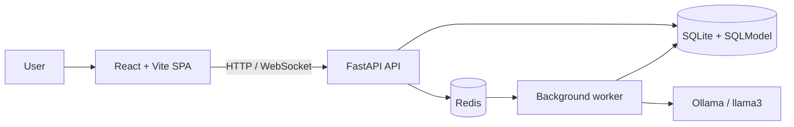

<div align="center">


# Blue Falcon Fitness

### Personalized workouts, nutrition, and progress tools built around each user's real goals and constraints.


</div>

## Why we built it

Many fitness products give every user a variation of the same generic plan. Blue Falcon Fitness personalizes the experience using the user's goals, activity level, age, measurements, available equipment, physical limitations, and dietary preferences.

The application combines a full-stack fitness tracker with explainable health calculations, tailored workout generation, nutrition tools, progress tracking, real-time chat, and optional local AI. If the AI service is unavailable, rule-based fallbacks keep core planning features usable.

> Blue Falcon Fitness is an educational software project, not a medical device. Its recommendations are not a substitute for professional medical advice.

## What it includes

- **Secure accounts and profiles** — JWT authentication, bcrypt password hashing, and Redis-backed token invalidation.
- **Personalized onboarding** — a multi-step quiz with unit toggles, validation, equipment, allergies, limitations, and a review screen.
- **Health calculations** — BMI, BMR, and TDEE computed from validated onboarding data.
- **Workout generation** — plans assembled from 873 normalized exercises, filtered by equipment, difficulty, goals, and injury contraindications.
- **Reliable AI fallback** — Ollama can enhance plans and reports, while deterministic rules keep the app functional offline.
- **Workout experience** — set tracking, swaps, progress indicators, rest timers, completion state, history, calendar views, and exercise animations.
- **Nutrition and reports** — queued generation, polling, rate limiting, and stored results.
- **Real-time chat** — WebSockets with Redis Pub/Sub and persisted chat history.
- **Additional tools** — muscle heat maps, supplement guidance, subscriptions, admin views, and fitness analytics.

## Architecture



The frontend never reads the database directly. Protected endpoints derive the user's identity from a verified JWT instead of trusting a user ID supplied by the browser. Redis supports logout invalidation, real-time messaging, and background task queues.

## Sanskriti Poudel's contributions

This is a collaborative team project. Sanskriti worked across the backend and frontend, with primary contributions including:

- onboarding models, schemas, CRUD operations, API endpoints, and the multi-step React quiz;
- BMI, BMR, and TDEE calculations plus validation and unit-conversion flows;
- workout-plan models, generation logic, persistence, API endpoints, and dynamic frontend views;
- integration of the free-exercise-db catalog, including equipment filters and injury-aware exclusions;
- set tracking, exercise swapping, weekly completion state, stale-plan detection, and progress indicators;
- workout history, calendar presentation, rest timers, and exercise animations;
- debugging, integration work, and pull-request delivery across multiple sprints.

The preserved Git history contains the complete team contribution record.

## Team

| Contributor | Role | Primary areas |
|---|---|---|
| Shawn Mele | Full Stack | Architecture documentation, sprint planning, muscle-map integration |
| Yuxi Luo | Backend + AI | WebSocket/Redis chat and original live-hosting integration |
| Sanskriti Poudel | Full Stack | Onboarding, health calculations, workout planning, tracking, history, timers, animations |
| Abraham Calzado Estrada | Full Stack | Equipment selection, workout details, profiles, routing, supplement features |
| Sergio Mendoza | Frontend | React foundation, landing page, design system, dashboard, workout and nutrition interfaces |

## Technology

| Layer | Technologies |
|---|---|
| Frontend | React 19, Vite 7, React Router, Axios, Recharts, Lottie |
| Backend | Python 3.11+, FastAPI, Pydantic, SQLModel |
| Data | SQLite, aiosqlite, Redis |
| Authentication | JWT, passlib, bcrypt, Redis token state |
| Optional AI | Ollama with a configurable local model |
| Tooling | npm, Uvicorn, FastAPI OpenAPI, SQLAdmin |

## Getting started

### Prerequisites

- Python 3.11+
- Node.js 18+
- Redis, locally installed or running in Docker
- Ollama only if you want local AI generation

### 1. Set up the backend

```bash
git clone <repository-url>
cd blue-falcon-fitness

python3 -m venv .venv
source .venv/bin/activate  # Windows: .venv\Scripts\activate
pip install -r requirements.txt

cp .env.example .env
```

Replace the placeholder secrets in `.env`. `SECRET_KEY`, `ADMIN_PASSWORD`, and `PREMIUM_COUPON` intentionally have no insecure defaults.

Start Redis:

```bash
docker run --rm -p 6379:6379 redis:alpine
```

Start the API:

```bash
uvicorn main:app --reload
```

The API runs at `http://localhost:8000`. Interactive OpenAPI documentation is available at `http://localhost:8000/docs`.

### 2. Set up the frontend

In a second terminal:

```bash
cd src/frontend
npm install
npm run dev
```

The frontend normally runs at `http://localhost:5173`. To point it at another backend, create `src/frontend/.env` containing:

```env
VITE_API_URL=http://localhost:8000
```

### 3. Enable local AI (optional)

```bash
ollama pull llama3
ollama serve
```

Then set `ENABLE_LLM_MODEL=true` in `.env` and restart the backend. With AI disabled, mock or rule-based paths remain available for supported features.

## Project layout

```text
.
├── docs/                  # Architecture, requirements, testing, and feature guides
├── scripts/               # Repository maintenance scripts
├── src/
│   ├── api/               # FastAPI routers
│   ├── core/              # Auth, configuration, calculations, AI, exercise logic
│   ├── crud/              # Database operations
│   ├── data/              # Normalized exercise catalog
│   ├── frontend/          # React + Vite application
│   ├── model.py           # SQLModel database entities
│   ├── schemas.py         # API request/response contracts
│   └── tasks.py           # Redis-backed AI worker
├── .env.example           # Safe configuration template
├── main.py                # API entry point and router registration
└── requirements.txt       # Python dependencies
```

## Documentation

- [System architecture](docs/architecture.md)
- [Requirements specification](docs/requirements-specification.md)
- [Project management plan](docs/project-management-plan.md)
- [Test plan](docs/test-plan.md)
- [Backend feature-development guide](docs/How_to_build_feature.md)
- [Async AI feature-development guide](docs/How_to_build_AI_feature.md)
- [Muscle-map guide](docs/muscle-heat-map.md)
- [Engineering onboarding guide](https://gray-clarie-96.tiiny.site/)

## Current limitations

- The production database is SQLite; PostgreSQL would be a better choice for heavier concurrent workloads.
- Schema changes currently require manual SQL because Alembic migrations are not configured.
- Automated test coverage is not yet comprehensive.
- Password-reset email delivery is not implemented.
- The previous custom-domain deployment is currently unavailable; run the project locally using the instructions above.

## Data and acknowledgements

- Exercise data is derived from [free-exercise-db](https://github.com/yuhonas/free-exercise-db).
- The application was developed collaboratively as a Texas State Software Engineering course project.
- Project planning and delivery used Git, Bitbucket, Jira, and pull-request review.

## License

No open-source license has been selected yet. All rights remain with the project contributors unless the team adds a license.
